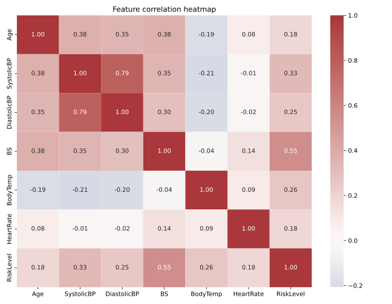
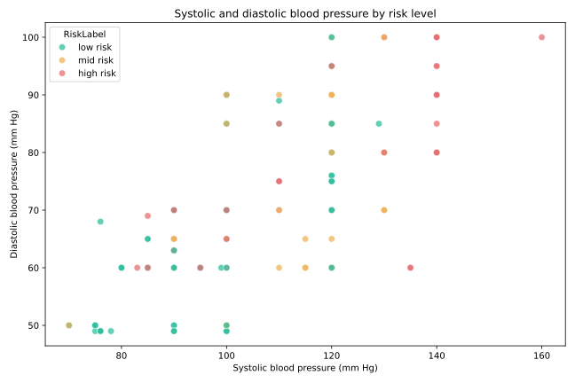
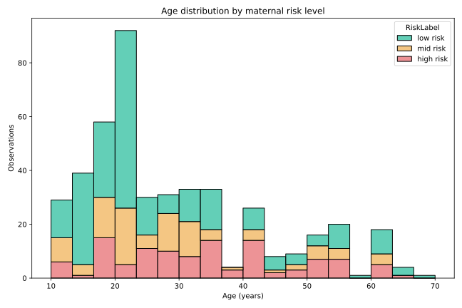
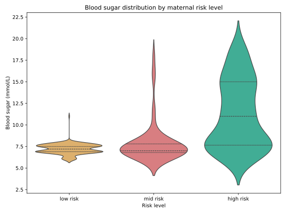
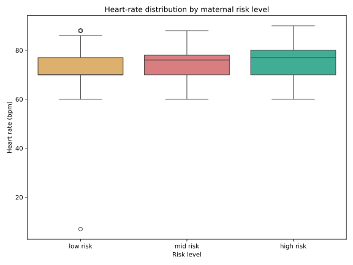
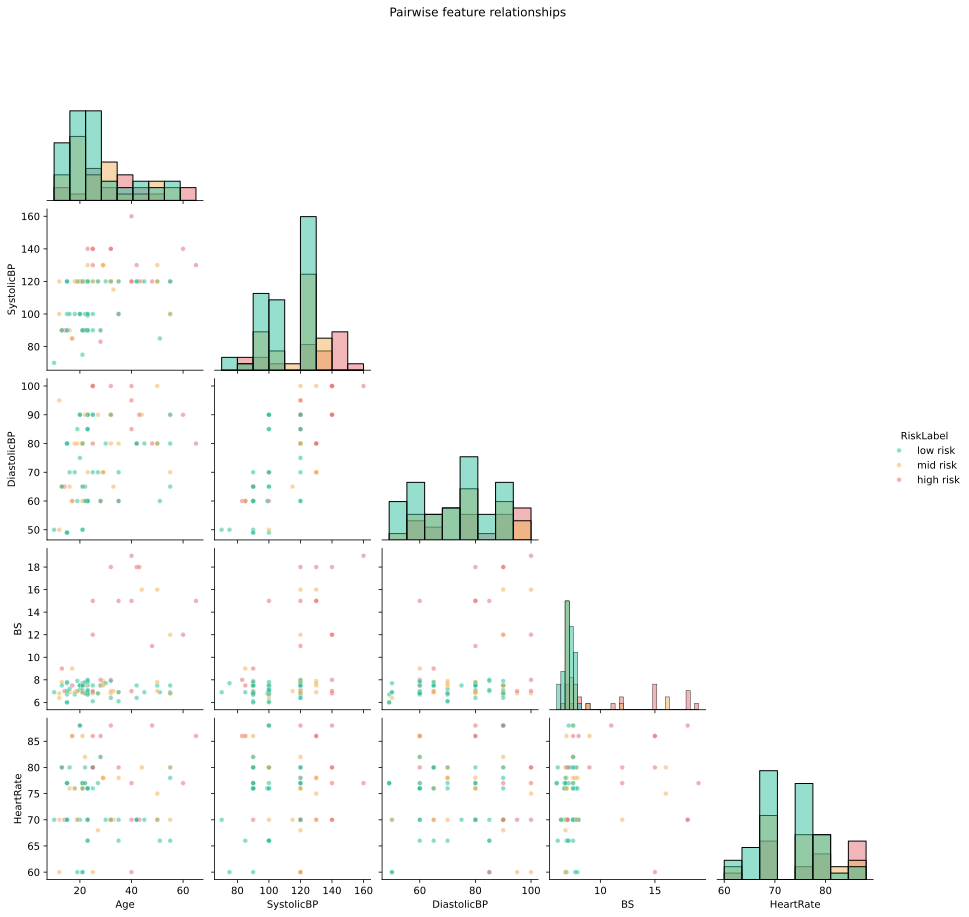
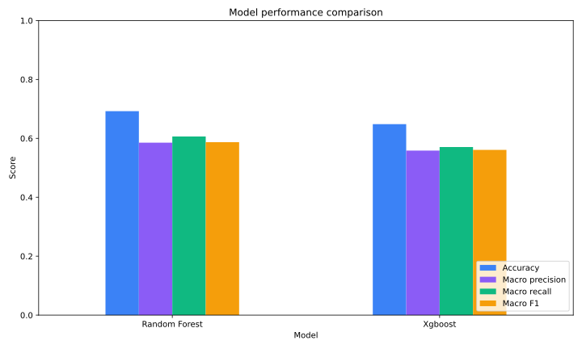
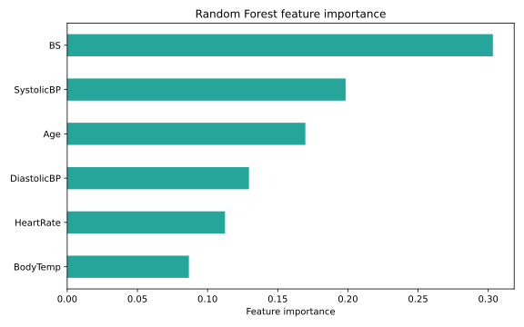
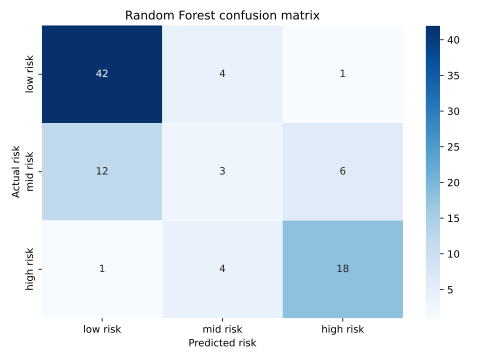
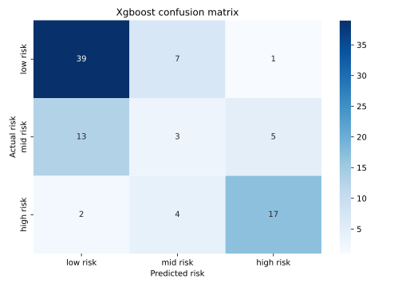

# Maternal Health Risk Prediction

An MSc Data Science project exploring whether routinely collected physiological indicators can support the classification of maternal health risk levels.

## Project overview

The analysis uses age, systolic and diastolic blood pressure, blood sugar, body temperature and heart rate to classify observations as low, mid or high risk. The original dissertation compared Random Forest, XGBoost and an Artificial Neural Network, supported by exploratory analysis, feature engineering and class-balancing experiments.

### Reported dissertation results

| Model | Accuracy | Precision | Recall | Notes |
|---|---:|---:|---:|---|
| XGBoost | 73% | 84% | 90% | Strongest reported recall for identifying high-risk cases |
| Random Forest | 72% | - | - | Competitive performance with straightforward feature importance |
| Artificial Neural Network | 66% | - | - | Lower performance on this relatively small tabular dataset |

The figures above reproduce the results reported in the submitted MSc dissertation. Exact results may vary with library versions, random seeds and evaluation choices.

## Analytical workflow

1. Validate column names, types, missing values and duplicated rows.
2. Explore class balance and feature distributions.
3. Stratify the train/test split before any resampling.
4. Apply scaling and SMOTE inside an imbalanced-learn pipeline to reduce leakage risk.
5. Compare Random Forest and XGBoost using accuracy, macro precision, macro recall, macro F1 and confusion matrices.
6. Export evaluation metrics and feature-importance charts for review.

## Visual analysis

The repository includes the exploratory and evaluation figures generated by the
reproducible pipeline. These are portfolio artefacts produced from the public
dataset, not clinical evidence.

### Feature relationships

| Correlation heatmap | Blood-pressure relationship |
|---|---|
|  |  |

| Age distribution | Blood-sugar distribution |
|---|---|
|  |  |

| Heart-rate distribution | Pairwise relationships |
|---|---|
|  |  |

### Model evaluation

| Model comparison | Random Forest feature importance |
|---|---|
|  |  |

| Random Forest confusion matrix | XGBoost confusion matrix |
|---|---|
|  |  |

## Repository structure

```text
.
|-- data/
|   `-- README.md
|-- reports/
|   `-- project-summary.md
|-- src/
|   `-- train.py
|-- .gitignore
|-- requirements.txt
`-- README.md
```

## Run locally

```bash
python -m venv .venv
source .venv/bin/activate       # Windows: .venv\Scripts\activate
pip install -r requirements.txt
python src/train.py --data data/maternal_health_risk.csv --output artifacts
```

The script creates:

- `artifacts/model_metrics.csv`
- six exploratory-analysis figures
- `artifacts/confusion_matrix_random_forest.svg`
- `artifacts/confusion_matrix_xgboost.svg`
- `artifacts/random_forest_feature_importance.svg`
- `artifacts/xgboost_feature_importance.svg`
- `artifacts/model_performance_comparison.svg`

## Key observations

- Blood pressure and blood sugar were prominent indicators in the exploratory analysis.
- Mid-risk observations overlapped with both low- and high-risk groups, making the multiclass boundary difficult.
- Recall is especially important in this context because missed high-risk cases may be more consequential than false alerts.
- A small public dataset cannot represent the diversity, clinical context or measurement quality required for real-world deployment.

## Responsible use

This repository is an academic demonstration only. It is **not a medical device**, has not been clinically validated and must not be used for diagnosis, triage or treatment decisions. Real clinical use would require representative data, external validation, calibration, bias assessment, governance and qualified medical oversight.

## Dataset

The project uses the public **Maternal Health Risk Data Set**, commonly distributed through the UCI Machine Learning Repository. See [`data/README.md`](data/README.md) for the expected schema and setup instructions.

## Author

**Gokul Anand Srinivasan**  
MSc Data Science, University of Hertfordshire  
[Portfolio](https://gokulanand2307.github.io/) | [GitHub](https://github.com/GokulAnand2307)
# Maternal Health Risk Prediction

An MSc Data Science project exploring whether routinely collected physiological indicators can support the classification of maternal health risk levels.

## Project overview

The analysis uses age, systolic and diastolic blood pressure, blood sugar, body temperature and heart rate to classify observations as low, mid or high risk. The original dissertation compared Random Forest, XGBoost and an Artificial Neural Network, supported by exploratory analysis, feature engineering and class-balancing experiments.

### Reported dissertation results

| Model | Accuracy | Precision | Recall | Notes |
|---|---:|---:|---:|---|
| XGBoost | 73% | 84% | 90% | Strongest reported recall for identifying high-risk cases |
| Random Forest | 72% | - | - | Competitive performance with straightforward feature importance |
| Artificial Neural Network | 66% | - | - | Lower performance on this relatively small tabular dataset |

The figures above reproduce the results reported in the submitted MSc dissertation. Exact results may vary with library versions, random seeds and evaluation choices.

## Analytical workflow

1. Validate column names, types, missing values and duplicated rows.
2. Explore class balance and feature distributions.
3. Stratify the train/test split before any resampling.
4. Apply scaling and SMOTE inside an imbalanced-learn pipeline to reduce leakage risk.
5. Compare Random Forest and XGBoost using accuracy, macro precision, macro recall, macro F1 and confusion matrices.
6. Export evaluation metrics and feature-importance charts for review.

## Repository structure

```text
.
|-- data/
|   `-- README.md
|-- reports/
|   `-- project-summary.md
|-- src/
|   `-- train.py
|-- .gitignore
|-- requirements.txt
`-- README.md
```

## Run locally

```bash
python -m venv .venv
source .venv/bin/activate       # Windows: .venv\Scripts\activate
pip install -r requirements.txt
python src/train.py --data data/maternal_health_risk.csv --output artifacts
```

The script creates:

- `artifacts/model_metrics.csv`
- `artifacts/confusion_matrix_random_forest.png`
- `artifacts/confusion_matrix_xgboost.png`
- `artifacts/random_forest_feature_importance.png`
- `artifacts/xgboost_feature_importance.png`

## Key observations

- Blood pressure and blood sugar were prominent indicators in the exploratory analysis.
- Mid-risk observations overlapped with both low- and high-risk groups, making the multiclass boundary difficult.
- Recall is especially important in this context because missed high-risk cases may be more consequential than false alerts.
- A small public dataset cannot represent the diversity, clinical context or measurement quality required for real-world deployment.

## Responsible use

This repository is an academic demonstration only. It is **not a medical device**, has not been clinically validated and must not be used for diagnosis, triage or treatment decisions. Real clinical use would require representative data, external validation, calibration, bias assessment, governance and qualified medical oversight.

## Dataset

The project uses the public **Maternal Health Risk Data Set**, commonly distributed through the UCI Machine Learning Repository. See [`data/README.md`](data/README.md) for the expected schema and setup instructions.

## Author

**Gokul Anand Srinivasan**  
MSc Data Science, University of Hertfordshire  
[Portfolio](https://gokulanand2307.github.io/) | [GitHub](https://github.com/GokulAnand2307)

